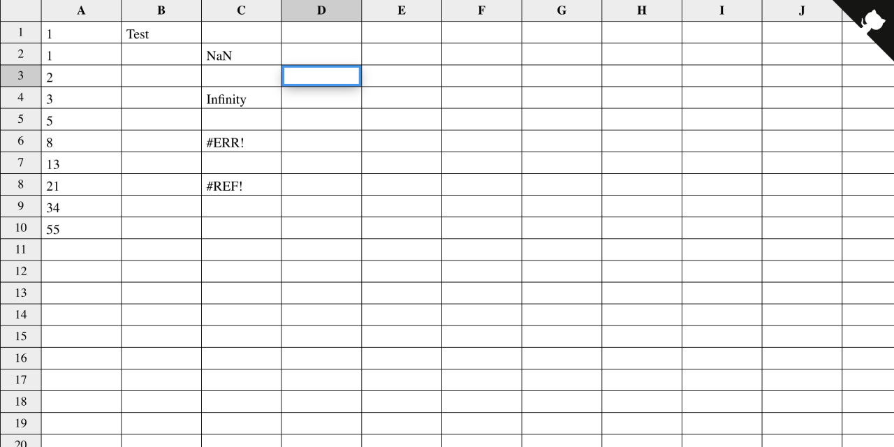

# React Spreadsheet

Simple spreadsheet built with ReactJS.

**Features**:
- stores state as GET params in URL
- cells are calculated in a [topological order](./src/evaluator/dag.ts) of a directed acyclic graph
- custom [expression evaluator](./src/evaluator/expression.ts)

[**Example**](https://polart.dev/react-spreadsheet?A1=Fibonacci&A2=0&A3=1&A4=%3DA2%2BA3&A5=%3DA3%2BA4&A6=%3DA4%2BA5&A7=%3DA5%2BA6&A8=%3DA6%2BA7&A9=%3DA7%2BA8&A10=%3DA8%2BA9&A11=%3DA9%2B10&c=20&r=50)



## Development

Vagrant Registry is written with ReactJS.

Make sure you have installed NodeJS and Yarn.

Install dependencies
```
$ yarn
```

Run tests
```
$ yarn test
```

Start dev server
```
$ yarn start
```

Open http://localhost:3000

## Production build

Create production build
```
$ yarn build
```
All files will be in `build` directory
